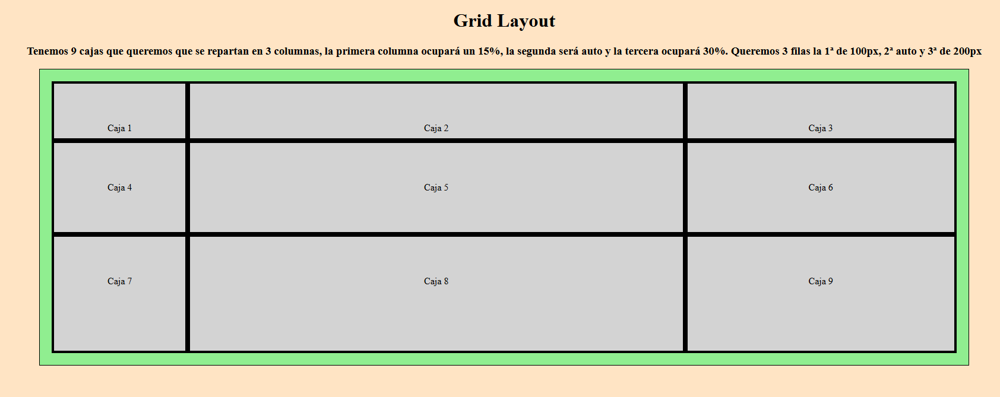
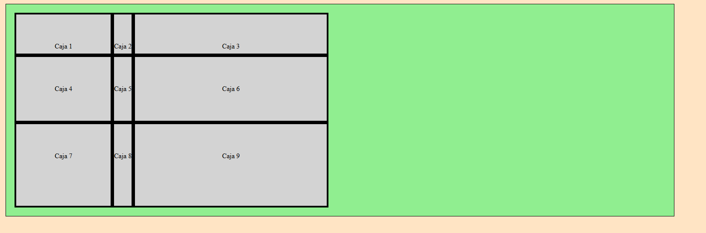
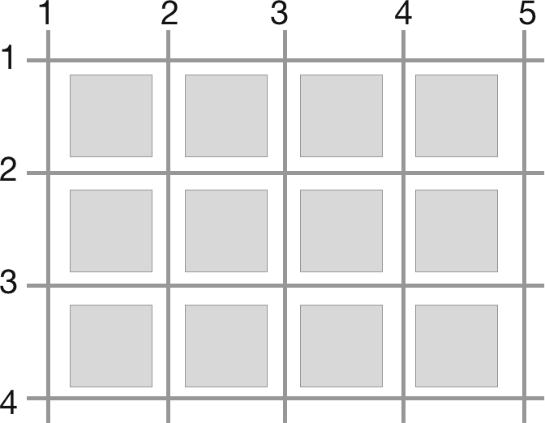
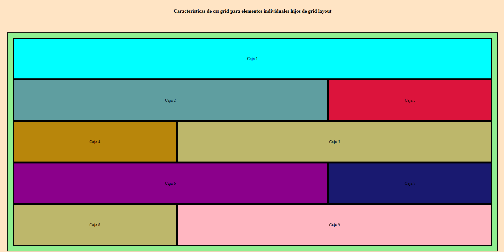
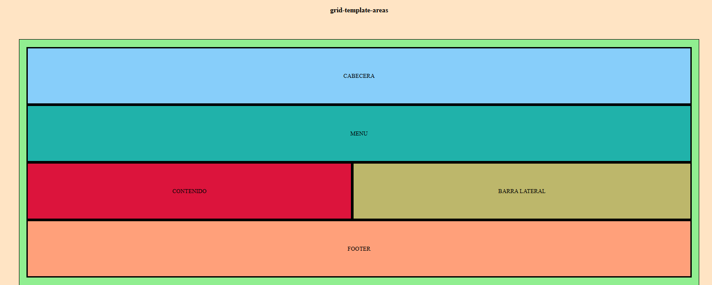

# Grid Layout
Grid Layout nos va a permitir hacer una cuadrícula que se adecue al sitio web que se está creando.

Grid consta de columnas y filas.

El primer paso es añadirle al contenedor padre un display: grid, una vez tenemos eso, pasamos a jugar con las columnas y las filas que sería usando las propiedades grid-template-columns y grid-template-rows.

- display: grid
- grid-template-columns:  Aquí se pone el número de columnas que queremos que tenga el grid, las medidas para las columnas pueden ser px, %, em, rem, fr, o poner en auto (si el contenido no tiene un tamaño específico al poner auto se adaptarán al tamaño de su contenedor padre, si tienen un tamaño específico lo respetará). Se pueden mezclar las medidas.
- grid-template-rows: Aquí se pone el número de filas que queremos que tenga el grid. Las medidas son iguales que en grid-template-columns.

EJEMPLO 1.
Tenemos 9 cajas que queremos que se repartan en 3 columnas, la primera columna ocupará un 15%, la segunda será auto y la tercera ocupará 30%. Queremos 3 filas la 1ª de 100px, 2ª auto y 3ª de 200px

```javascript
.grid-layout {
    display: grid; 
    grid-template-columns: 15% auto 30%; 
    grid-template-rows: 100px auto 200px;
    width: 80%;
    margin: 0 auto;
    background-color: lightgreen;
    padding: 20px;
    border: 1px solid black;
}
```




Con grid también se puede usar la propiedad
- justify-content: Esto nos va permitir alinear el contenido donde nos interesa. Aquí hay que tener en cuenta que las filas y las columnas que tengan el valor “auto” se van a adaptar al espacio que ocupe el contenido que tengan.

EJEMPLO 2 usando justify-content: flex-start;

```javascript
.grid-layout {
    display: grid; 
    grid-template-columns: 15% auto 30%; 
    grid-template-rows: 100px auto 200px;
    justify-content: flex-start;
    width: 80%;
    margin: 0 auto;
    background-color: lightgreen;
    padding: 20px;
    border: 1px solid black;
}
```



## Características de css grid para elementos individuales hijos de grid layout
Las propiedades de los elementos hijos dentro de un grid que se utilizan “grid-column” y “grid-row”

>[!IMPORTANT]
>Es importante saber cómo funcionan las filas y las columnas en el grid.




- grid-column: Nos permite indicarle cuantas columnas queremos que ocupe un elemento en concreto dentro del grid. Una manera de hacerlo es poner: 1/3  esto quiere decir que el primer elemento del grid ocupe desde la 1ª línea vertical hasta la 3ª. Otra forma de hacerlo es poner: 1 / span 3 que quiere decir que se expanda 3 columnas.
  
- grid-row: Nos permite indicarle cuántas filas queremos que ocupe un elemento en concreto dentro del grid. La manera de hacerlo es igual que en “grid-column”.

EJEMPLO 3.
Queremos que la caja 1 ocupe las 3 columnas, para eso vamos a decirle que se expanda desde la 1ª línea vertical hasta la 4ª y así sucesiamente con el resto de cajas.

```javascript
.c1 {
    grid-column: 1/4;/* Aquí le indicamos a la 1ª caja que ocupe de la 1ª línea de la columna hasta la 4ª */
    background-color: cyan;
}

.c2 {
    grid-column: 1/3;
    background-color: cadetblue;
}

.c3 {
    grid-column: 3/4;
    background-color: crimson;
}

.c4 {
    grid-column: 1/2;
    background-color: darkgoldenrod;
}

.c5 {
    grid-column: 2/4;
    background-color: darkkhaki;
}

.c6 {
    grid-column: 1/3;
    background-color: darkmagenta;
}

.c7 {
    grid-column: 3/4;
    background-color: midnightblue;
}

.c8 {
    grid-column: 1/2;
    background-color: darkkhaki;
}

.c9 {
    grid-column: 2/4;
    background-color: lightpink;
}

.c10 {
    grid-column: 1/4;
    background-color: darkslategrey;
}
```


### Una propiedad MUY interesante de grid layout es el grid-template-areas

- grid-template-areas: Es una propiedad que permite definir y nombrar áreas específicas dentro de un diseño de cuadrícula CSS. Esta propiedad mejora la legibilidad y el mantenimiento del CSS al permitir especificar cómo se organizan los elementos en un formato de cuadrícula utilizando áreas nombradas.

Cómo funciona:


- Definiendo Áreas: Se pueden definir áreas de cuadrícula utilizando cadenas que representan el diseño. Cada cadena corresponde a una fila en la cuadrícula, y los nombres dentro de la cadena representan las columnas. Por ejemplo, si tenemos un diseño de cuadrícula con tres áreas llamadas "cabecera", "contenido" y "pie de página", se puede definir de la siguiente manera:

```
.grid-container {
    display: grid;
    grid-template-areas: 
        "cabecera cabecera cabecera"
        "contenido contenido barra-lateral"
        "pie-de-pagina pie-de-pagina pie-de-pagina";
}
```

- Celdas que Ocupan Espacio: Si repetimos un nombre en la plantilla de cuadrícula, se crea un área de cuadrícula nombrada que ocupa las celdas de cuadrícula correspondientes. Esto permite diseños flexibles donde los elementos pueden ocupar múltiples celdas.
  
- Celdas Vacías: También se pueden representar celdas vacías en nuestro diseño utilizando un punto (.). Por ejemplo, si deseas dejar un espacio en tu cuadrícula, puedes incluir un punto en la cadena.

#### Beneficios de Usar grid-template-areas:

- Claridad: Usar áreas nombradas facilita la comprensión del diseño de un vistazo, en lugar de usar líneas de cuadrícula numéricas.
- Mantenibilidad: Simplifica el proceso de reorganizar elementos en la cuadrícula. Se puede cambiar el diseño modificando las cadenas sin necesidad de ajustar las ubicaciones de los elementos individuales.
- Diseño Responsivo: Las áreas nombradas se ajustan fácilmente a diferentes tamaños de pantalla, lo que lo convierte en una excelente herramienta para el diseño responsivo.

EJEMPLO 4.
Maquetación de página con grid-template-areas

```javascript
.grid-layout-ejemplo-4 {
    display: grid; /*Grid siempre se pone en el contenedor padre del contenido que queremos manejar*/
    grid-template-areas: 'cabecera cabecera'
                            'menu menu'
                            'contenido lateral'
                            'footer footer';
    width: 80%;
    margin: 0 auto;
    background-color: lightgreen;
    padding: 20px;
    border: 1px solid black;

}

.caja {
    background-color: lightgray;
    border: 4px solid black;
    text-align: center;
    line-height: 150px; /*Altura entre líneas, como solo es 1 línea y tiene los mismos px que la caja el texto se centra en el medio.*/
}

.cabecera {
    grid-area: cabecera;
    background-color: lightskyblue;
}

.menu {
    grid-area: menu;
    background-color: lightseagreen;
}

.contenido {
    grid-area: contenido;
    background-color: crimson;
}

.barra-lat {
    grid-area: lateral;
    background-color: darkkhaki;
}

.footer {
    grid-area: footer;
    background-color: lightsalmon;
}
```




>[!NOTE]
>Enlace a video de youtube de CSS Grid Layout https://www.youtube.com/watch?v=-kgGATnsPbs&t=725s


